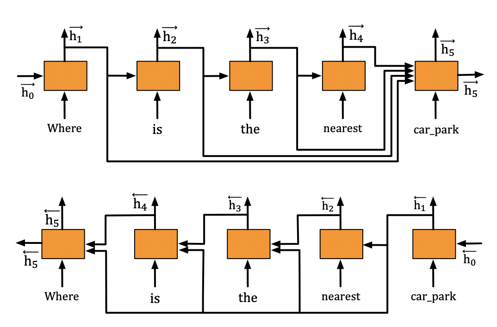

## GraphDialog

This is the Tensorflow implementation of the paper:
**GraphDialog: Integrating Graph Knowledge into End-to-End Task-Oriented Dialogue Systems**. ***EMNLP 2020***. 

This code has been written using Tensorflow >= 2.0.0. Please make sure that you have installed all the necessary dependency files according to the dependency list below to successfully run this software.

## Architecture
<table>
    <tr>
        <td ><center> </center></td>
        <td ><center> </center></td>
    </tr>
</table>


## Dependencies
* Tensorflow >= 2.0.0
* Spacy 2.2.1
* cudatoolkit 10.0.130
* cudnn 7.6.0
* tqdm 4.36.1
* nltk 3.4.5
* numpy 1.17.2
* python 3.7.4


## Model Training
We created `myTrain.py` to train the models. You can run:
```console
python myTrain.py -lr=0.001 -hdd=128 -dr=0.2 -bsz=128 -l=1 -ds=multiwoz -maxdeps=7 -revgraph=0
```
While training, the model with the best validation results is stored. If you want to reuse a model, please add `-path=path_name_model` to the call. The model is evaluated by BLEU and Entity F1.

## Model Testing
We created `myTest.py` to restore the checkpoints and test the models. You can run:
```console
python myTest.py -ds=<dataset_name> -path=<path_to_saved_model>
```

## Reproducibility
We've attached the checkpoints to facilitate the reproduction of the results in the paper.
You can run:
```console
python myTest.py -path=save/GraphDialog-MULTIWOZ/multiwozHDD128BSZ128DR0.2L1lr0.001ENTF1-0.1513/ckpt-9 -ds=multiwoz
```

## Citation
If you find the source codes or the datasets included in this toolkit useful to your work, please kindly consider citing our paper. The bibtex is listed below:
<pre>

</pre>