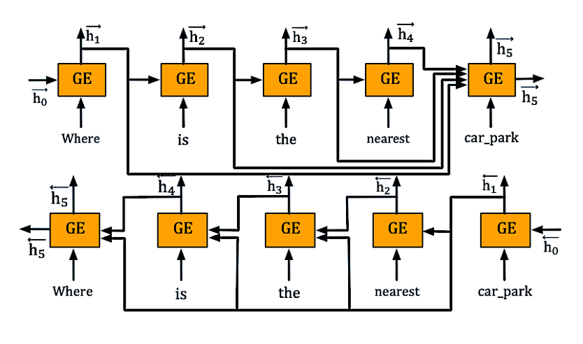
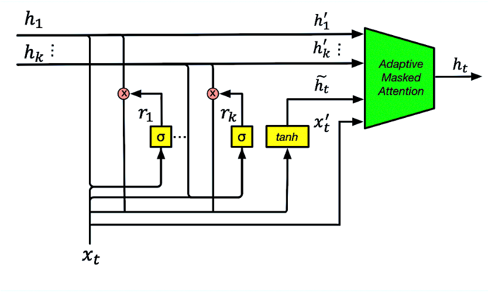

## GraphDialog

This is the Tensorflow implementation of the paper:
**GraphDialog: Integrating Graph Knowledge into End-to-End Task-Oriented Dialogue Systems**. ***EMNLP 2020***. 

This code has been written using Tensorflow >= 2.0.0. If you find the source codes or the datasets included in this software useful to your work, please consider citing our paper. The bibtex is:
<pre>
@inproceedings{yang-etal-2020-graphdialog,
    title = "{G}raph{D}ialog: Integrating Graph Knowledge into End-to-End Task-Oriented Dialogue Systems",
    author = "Yang, Shiquan and Zhang, Rui and Erfani, Sarah",
    booktitle = "Proceedings of the 2020 Conference on Empirical Methods in Natural Language Processing (EMNLP)",
    year = "2020",
    url = "https://www.aclweb.org/anthology/2020.emnlp-main.147",
    pages = "1878--1888"
}
</pre>

## Architecture
<table>
    <tr>
        <td ><center> </center></td>
        <td ><center> </center></td>
    </tr>
</table>


## Requirements
* Tensorflow 2.0.0a0
* Spacy 2.2.1
* cudatoolkit 10.0.130
* cudnn 7.6.0
* tqdm 4.36.1
* nltk 3.4.5
* numpy 1.17.2
* python 3.7.4


## Training
We created `myTrain.py` to train the models. For SMD dataset, you can run:
```console
python myTrain.py -maxdeps=5 -revgraph=0 -lr=0.001 -hdd=128 -dr=0.2 -bsz=32 -l=1 -ds=kvr
```
For MultiWOZ 2.1 dataset, you can run:
```console
python myTrain.py -maxdeps=5 -revgraph=0 -lr=0.001 -hdd=128 -dr=0.2 -bsz=128 -l=1 -ds=multiwoz
```
While training, the model with the best validation results is stored. If you want to reuse a model, please add `-path=path_name_model` to the call. The model is evaluated by BLEU and Entity F1.


## Evaluation
We created `myTest.py` to restore the checkpoints and test the models. For SMD dataset, you can run:
```console
python myTest.py -path=<path_to_saved_model> -ds=kvr -maxdeps=5 -graphhdd=128 -nheads=1 -rec=1 -graph_layer=1
```
For MultiWOZ 2.1 dataset, you can run:
```console
python myTest.py -path=<path_to_saved_model> -ds=multiwoz -maxdeps=5 -graphhdd=128 -nheads=1 -graph_layer=1
```

## Reproducibility
We've attached the checkpoints to facilitate the reproduction of the results in the paper.
For example, for SMD dataset, you can run:
```console
python myTest.py -path=save/GraphDialog-KVR/KVRHDD128BSZ32DR0.2L3lr0.001ENTF1-0.4768/ckpt-16 -ds=kvr -rec=1 -maxdeps=5 -graphhdd=128 -nheads=1 -graph_layer=1
```
For MultiWOZ 2.1 dataset, you can run:
```console
python myTest.py -path=save/GraphDialog-MULTIWOZ/multiwozHDD128BSZ128DR0.2L1lr0.001ENTF1-0.1513/ckpt-9 -ds=multiwoz -maxdeps=7 -graphhdd=128 -nheads=1 -graph_layer=1
```

## Others
If you have any questions, please feel free to send us emails (shiquan@student.unimelb.edu.au). We are happy to help you:blush: !
